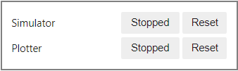
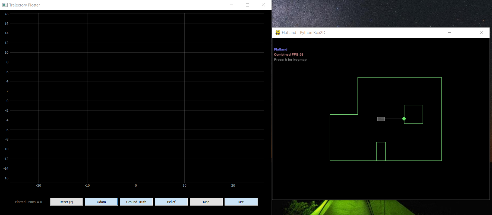
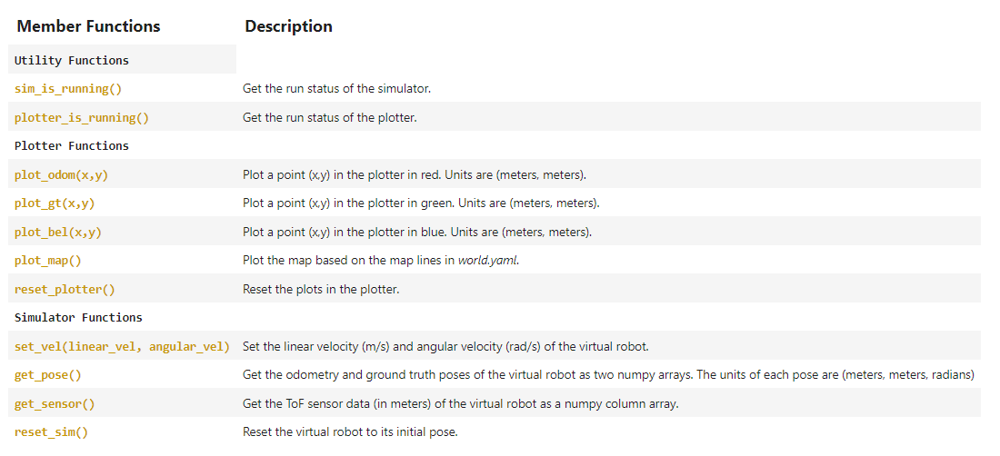
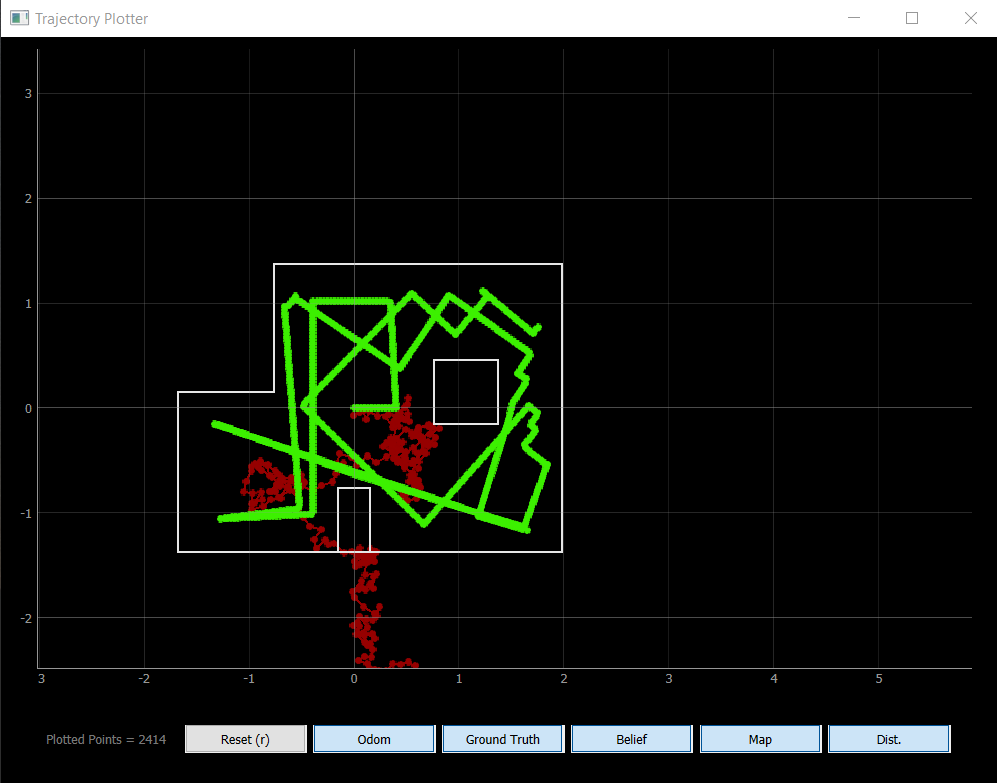

## LAB 10: SIMULATION

[Back to Home](./index.html)

As we move on to performing planning and execution tasks at the end of the semester, we want to use a platform to validate our algorithms for localization, planning and execution. The course staff developed and released a simulation tool that provides us with a virtual robot that can execute desired trajectories and plotters that allow us to visualize the performance of this robot on the class map. With this simulator, we perform trajectory executions in this lab, and a Bayes Filter localization in the next lab before moving code onto the robot for testing.

#### Setup

The lab handout provided detailed instructions on the installation of the simulator codebase and relevant support. Since my Python version was up to date, I proceeded to create the virtual environment and run `python3 -m pip install numpy pygame pyqt5 pyqtgraph pyyaml ipywidgets colorama` to install the necessary python packages. I then downloaded the provided pip wheels for obtaining the Box2D library and then checked that I had the correct version (2.3.10). Finally, I obtained the remaining simulation base code and Lab 10 Jupyter notebook from GitHub.

#### Core details of the simulator

The codebase provides a GUI as well as functions for starting up the robot simulator and plotter. The images below show the GUI as well as the initialized simulator and plotter.

** Insert images **




We can use the mouse or keyboard to interact with the buttons on the plotter, or use the `Commander` class to programmatically select options for the simulator. The following image shows the member functions of the Commander class, along with definitions of what they control on the simulator.



#### Task 1: Open Loop Control

In this task, we want to make the virtual robot drive around in a square loop in the simulator using open loop control. This was fairly straightforward; we could control the linear and angular velocities of the virtual robot using the `cmdr.set_vel()` function. I simply made the robot drive forward for 3 seconds with a linear velocity of 0.1 m/s and then turn for 1 second with an angular velocity of 90 degrees per second. This approximates a square loop quite well for the first run, but over several square loops, the path starts deviating fairly significantly. This is likely because the OS scheduler does not account for exact amounts of time, which causes the distance and turn to accumulate error over time. The ground truth plot follows the trajectory of the robot; however, the odometry plot is far more difficult to use deterministically (it should also be square!) since it accounts for IMU noise and is an imitation of what the sensors may actually measure. The following code, images and video demonstrate the open loop control I used.

```python
# Task 1 - Programmatically control robot in open loop control square
# Reset Plotter and Simulator
cmdr.reset_plotter()
cmdr.reset_sim()

# Show map
cmdr.plot_map()

# Loop for pose
while cmdr.sim_is_running() and cmdr.plotter_is_running():
    pose, gt_pose = cmdr.get_pose()
    cmdr.plot_odom(pose[0], pose[1])
    cmdr.plot_gt(gt_pose[0], gt_pose[1])
    
    # Move forward 0.3 meters and turn 90 degrees
    cmdr.set_vel(0.1, 0)
    await asyncio.sleep(3)
    cmdr.set_vel(0, 1.52)
    await asyncio.sleep(1)
```


##### Insert video

#### Task 2: Closed Loop Control

In this task, we want to make the robot perform obstacle avoidance while executing a trajectory. We can use the `cmdr.get_sensor()` to acquire distance values from the ToF sensor on the simulated robot and make the robot turn away once an obstacle is some threshold distance away. To make the trajectory more interesting, I randomized the turn angle every time the robot detected an obstacle within the threshold distance. This enabled the virtual robot to traverse through a fairly significant portion of the map and for me to evaluate its performance in multiple spots. The code and video below demonstrate how I implemented closed loop obstacle avoidance.

```python
# Task 2 - Programmatically control robot for closed loop obstacle avoidance
# Reset Plotter and Simulator
cmdr.reset_plotter()
cmdr.reset_sim()

# Show map
cmdr.plot_map()

# Loop for pose
while cmdr.sim_is_running() and cmdr.plotter_is_running():
    pose, gt_pose = cmdr.get_pose()
    cmdr.plot_odom(pose[0], pose[1])
    cmdr.plot_gt(gt_pose[0], gt_pose[1])
    
    sensor_values = cmdr.get_sensor()
    if sensor_values[0] > 0.35:
        # Move forward 
        cmdr.set_vel(0.1, 0)
        # await asyncio.sleep(1)
    else:
        # Turn 90 degrees
        cmdr.set_vel(0, np.random.choice([-1.52, 1.52]))
        await asyncio.sleep(1)
```



While we do know how close the robot is to an obstacle thanks to the ToF sensor, it is difficult to determine the value by which the robot should turn to avoid the obstacle entirely. Randomizing the angle makes it more feasible for the robot to avoid an obstacle, but the process is not always deterministic.

I chose to make the robot go slow so that I could analyze its behavior. I attempted pushing the velocity higher, but due to the small map size and the minor timing inaccuracies, it runs into obstacles more frequently.

By no means is the obstacle avoidance I implemented correct. In some cases, the robot is at a diagonal angle and the ToF sensor reads a distance value greater than the threshold, due to which the robot attempts to keep moving straight despite having collided with a wall. As I decreased the threshold distance, such collisions became increasingly frequent.

This was an interesting lab. It took some of the pressure off of the more hardware focused sections and allowed us to understand the importance of using simulations to validate hardware implementations.
