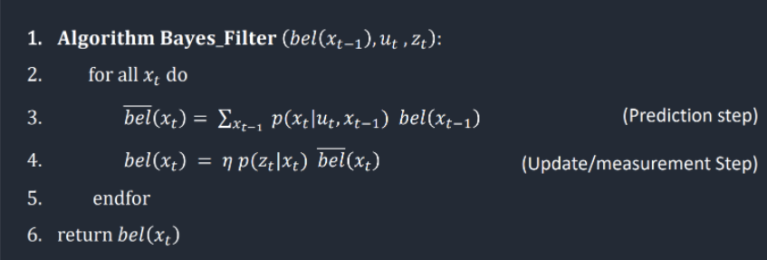
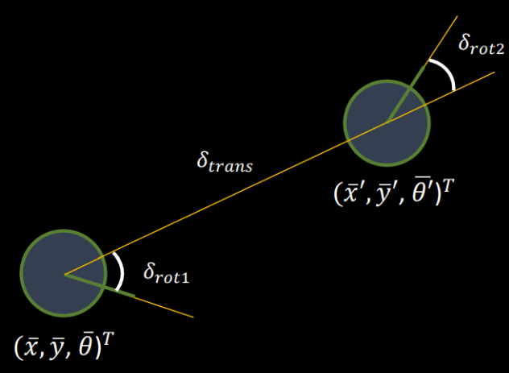

## LAB 11: LOCALIZATION (BAYES FILTER, SIMULATION)

[Back to Home](./index.html)

Bayes Filter is a powerful probabilistic tool for estimating a robot's state given only its previous position, control input and sensor accuracy. Lab 11 involves implementing this filter and observing its performance in simulation, allowing us to observe the potential performance of our robot in the real-world map first shown in Lab 9 and track down potential points of failure.

#### Implementation



The codebase for this lab consisted of several useful classes that abstract away the nuances of setting up the environment and trajectory for the robot, allowing us to focus on the implementation of the filter itself. Broadly, the implementation of the filter was split into the following steps:

(i) Computing the control information using odometry data for current and previous poses; 

(ii) Computing the probability distribution for position from the odometry motion model;

(iii) Predicting the belief distribution for grid localization based on the odometry model and prior belief;

(iv) Calculating the probability distribution for the sensor model given actual distances;

(v) Updating the belief distribution using the predicted belief and the sensor model.

The principal part of the filter is covered in steps (iii) to (v), as given in the pseudocode for the algorithm in lecture. We define the robot state in terms of `(x, y, yaw angle)` in order to get the position and orientation of the robot. The robot is bounded between -5.5 to 6.5 feet in both the x and y directions, and from -180 to 180 degrees over yaw angles. The real world map consists of discrete 1 foot by 1 foot tiles, and the angular range is split into 18 intervals, for a total of 1944 unique grid cells.

##### Compute Control information



The `compute_control` function is used to calculate the control coefficients (in terms of a rotation, followed by a translation, followed by a rotation) given two odometry poses in the form `(x, y, angle)` as illustrated in the below diagram and the corresponding code segment.

```python
def compute_control(cur_pose, prev_pose):
    """ Given the current and previous odometry poses, this function extracts
    the control information based on the odometry motion model.

    Args:
        cur_pose  ([Pose]): Current Pose
        prev_pose ([Pose]): Previous Pose 

    Returns:
        [delta_rot_1]: Rotation 1  (degrees)
        [delta_trans]: Translation (meters)
        [delta_rot_2]: Rotation 2  (degrees)
    """
    x_cur   = cur_pose[0]
    y_cur   = cur_pose[1]
    yaw_cur = cur_pose[2]
    
    x_prev   = prev_pose[0]
    y_prev   = prev_pose[1]
    yaw_prev = prev_pose[2]
    
    # Following lecture equations for control values
    delta_rot_1 = mapper.normalize_angle(np.degrees(np.arctan2(y_cur - y_prev, x_cur - x_prev)) - yaw_prev)
    delta_trans = np.sqrt((x_cur - x_prev)**2 + (y_cur - y_prev)**2)
    delta_rot_2 = mapper.normalize_angle(yaw_cur - yaw_prev - delta_rot_1)
    
    return delta_rot_1, delta_trans, delta_rot_2
```

##### Odometry motion model

The odometry motion model calculates the probability of the robot moving to a given position, given a prior position and control sequence `p(x'|x, u)`. To account for uncertainties in odometry, we sample the probabilities from a gaussian distribution with rotation and translation uncertainties dictating the standard deviation of the distribution. The formula and corresponding code snippet is provided below.

```python
def odom_motion_model(cur_pose, prev_pose, u):
    """ Odometry Motion Model

    Args:
        cur_pose  ([Pose]): Current Pose
        prev_pose ([Pose]): Previous Pose
        (rot1, trans, rot2) (float, float, float): A tuple with control data in the format 
                                                   format (rot1, trans, rot2) with units (degrees, meters, degrees)


    Returns:
        prob [float]: Probability p(x'|x, u)
    """
    # Account for difference in relative motion parameters for given states and motion parameters from odometry    
    actual_u = u
    u_calc   = compute_control(cur_pose, prev_pose)
    
    odom_rot_noise   = loc.odom_rot_sigma
    odom_trans_noise = loc.odom_trans_sigma
    
    # Compute rotation and translation probabilities from a gaussian distribution
    prob_rot1  = loc.gaussian(actual_u[0] - u_calc[0], actual_u[0], odom_rot_noise)
    prob_trans = loc.gaussian(actual_u[1] - u_calc[1], actual_u[1], odom_trans_noise)
    prob_rot2  = loc.gaussian(actual_u[2] - u_calc[2], actual_u[2], odom_rot_noise)
    
    prob = prob_rot1 * prob_trans * prob_rot2

    return prob
```

##### Prediction Step

With the odometry motion model and the control computation mechanism established, we calculate the predicted belief (or `bel_bar`) for each of the 1944 grid cells in our map based on the prior belief matrix and control data for the most recent movement. In this process, we iterate over every cell in the map twice (once for the prior belief and once for the current predicted beliefs). Due to the computational cost associated with this step, we filter out belief values below a specific probability (0.01%) and normalize the resulting matrix to maintain a total probability sum of 1. 

```python
def prediction_step(cur_odom, prev_odom):
    """ Prediction step of the Bayes Filter.
    Update the probabilities in loc.bel_bar based on loc.bel from the previous time step and the odometry motion model.

    Args:
        cur_odom  ([Pose]): Current Pose
        prev_odom ([Pose]): Previous Pose
    """
    # Store localization object variables in local data structures
    bel_bar = loc.bel_bar
    bel     = loc.bel
    actual_u = compute_control(cur_odom, prev_odom)
    
    x_s, y_s, a_s = bel_bar.shape
    
    for x_cur in range(x_s):
        for y_cur in range(y_s):
            for a_cur in range(a_s):
                cur_pose = np.array([x_cur, y_cur, a_cur])
                # Filter out low probability values
                if bel[x_cur][y_cur][a_cur] > 0.0001:
                    for x_prev in range(x_s):
                        for y_prev in range(y_s):
                            for a_prev in range(a_s):
                                prev_pose = np.array([x_prev, y_prev, a_prev])
                                bel_bar[x_cur][y_cur][a_cur] += odom_motion_model(cur_pose, prev_pose, actual_u) * bel[x_prev][y_prev][a_prev]
    
    # Normalize beliefs to sum to 1
    bel_bar    /= np.sum(bel_bar)
    loc.bel_bar = bel_bar
```

##### Sensor Model

The sensor model in the Bayes Filter gives us the probability of the similarity of sensor readings to the actual distances observed at a particular location. Like the `compute_control()` function, we use a Gaussian to compute the probability of the obtained sensor measurements.

```python
def sensor_model(obs):
    """ This is the equivalent of p(z|x).


    Args:
        obs ([ndarray]): A 1D array consisting of the measurements made in rotation loop

    Returns:
        [ndarray]: Returns a 1D array of size 18 (=loc.OBS_PER_CELL) with the likelihood of each individual measurements
    """
    # Initialize array based on observations from ToF
    prob_array = np.zeros(mapper.OBS_PER_CELL)
    
    # For a given pose, the probability of the obtained sensor measurement based on true observations 
    for msr in range(mapper.OBS_PER_CELL):
        prob_array[msr] = loc.gaussian(loc.obs_range_data[msr], obs[msr], loc.sensor_sigma)

    return prob_array
```

##### Update Step

The update step uses the predicted beliefs and the sensor model to compute the actual state beliefs of the robot. Like the prediction step, the beliefs have to be updated for every grid cell in the map, which means that we iterate through all 1944 possible states. To account for any discrepancy from the multiplication of the sensor model and the predicted belief, we normalize the belief distribution to ensure that we do not accumulate error.

```python
def update_step():
    """ Update step of the Bayes Filter.
    Update the probabilities in loc.bel based on loc.bel_bar and the sensor model.
    """
    # Store localization variables in local data structures
    bel           = loc.bel
    bel_bar       = loc.bel_bar
    eta           = loc.sensor_sigma
    x_s, y_s, a_s = bel.shape
    
    for x_cur in range(x_s):  
        for y_cur in range(y_s):
            for a_cur in range(a_s):
                # Compute the sensor model at the cell alongside the probability of the similarity of actual distance to observations
                sens_model = np.prod(sensor_model(mapper.get_views(x_cur, y_cur, a_cur)))
                
                # Update belief based on sensor model and belief barred
                bel[x_cur][y_cur][a_cur] = sens_model * bel_bar[x_cur][y_cur][a_cur]
    
    bel    /= np.sum(bel)
    loc.bel = bel
```

#### Results
The videos below show the robot's trajectory, odometry, belief and marginal distribution for the best run of the Bayes' Filter algorithm I implemented using the above code snippets. By observing the belief and marginal distribution, we can see that the Bayes Filter approximates the robot's state quite well!

<iframe width="560" height="315" src="https://www.youtube.com/embed/bDZRUPY3zu0" title="YouTube video player" frameborder="0" allow="accelerometer; autoplay; clipboard-write; encrypted-media; gyroscope; picture-in-picture" allowfullscreen></iframe>

<iframe width="560" height="315" src="https://www.youtube.com/embed/gML6piWjRWY" title="YouTube video player" frameborder="0" allow="accelerometer; autoplay; clipboard-write; encrypted-media; gyroscope; picture-in-picture" allowfullscreen></iframe>

There are definitely some code optimizations I can make to improve the runtime of the program. I chose to maintain local variables in the prediction and update steps for the sake of easy debugging - however, reassigning the values to the class variable in both cases consumes time. In addition, I could also have factored in the sensor model computation within the update step itself as opposed to in a different function in order to decrease context switching to a different function for calculation. I will make these updates for Lab 12!
