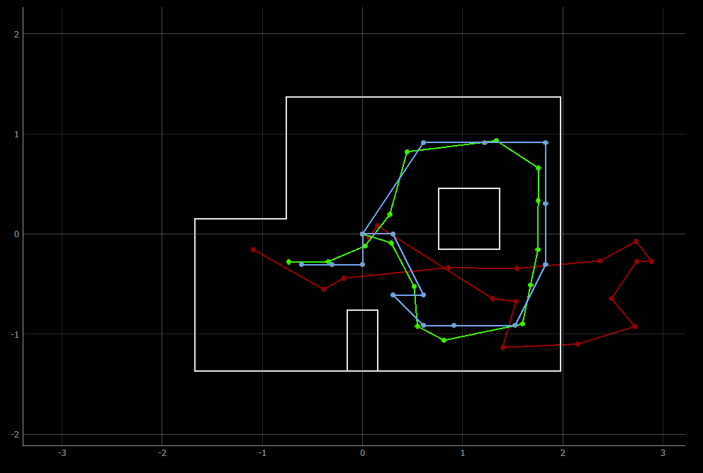
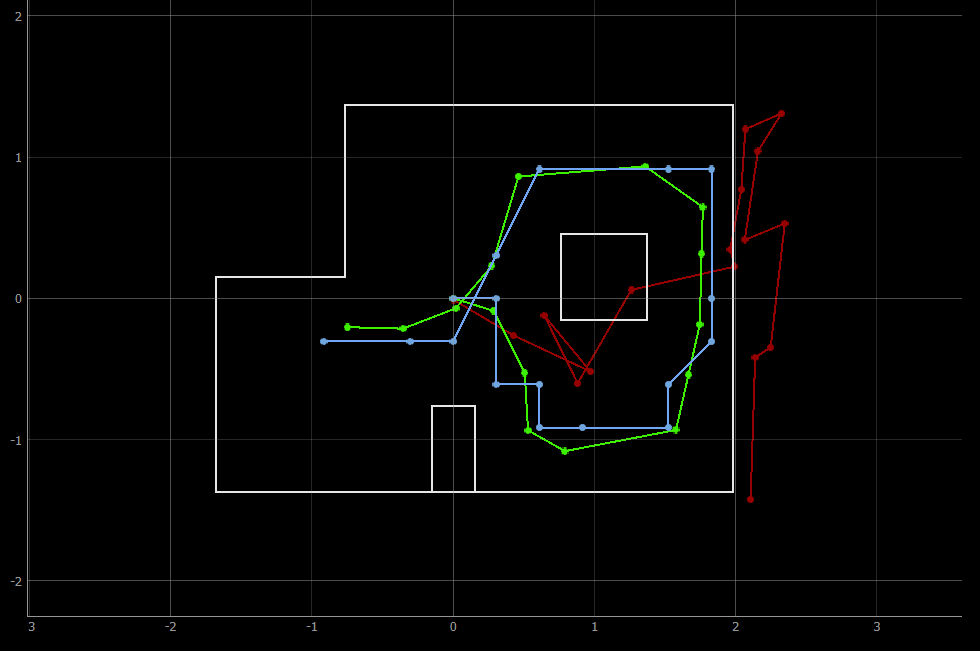
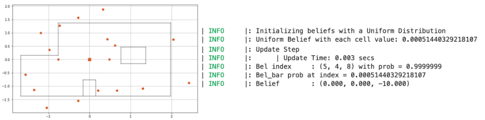
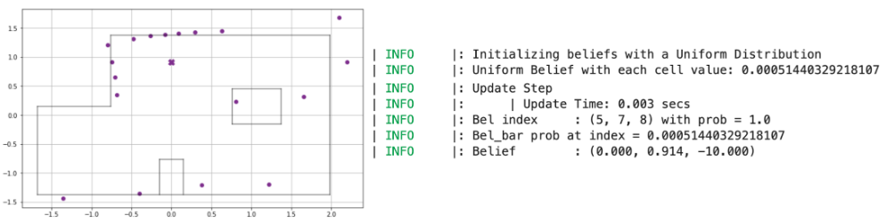
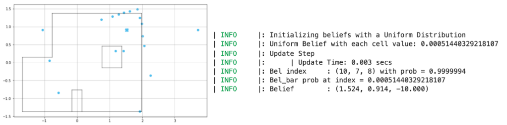
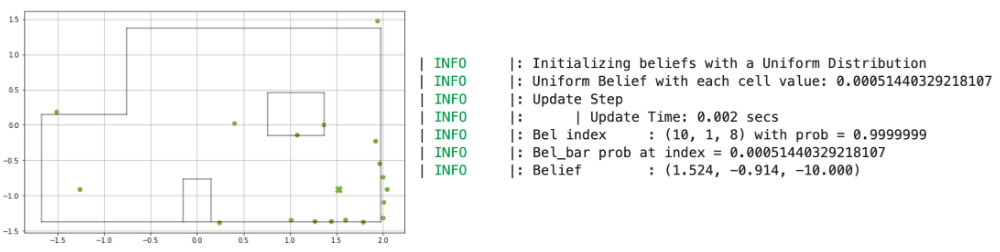
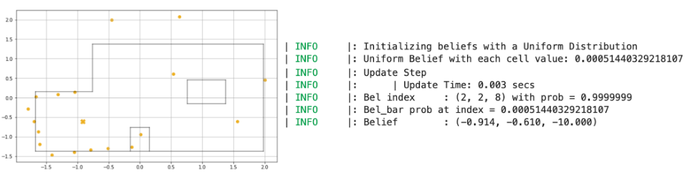

## LAB 12: LOCALIZATION (BAYES FILTER, REAL)

[Back to Home](./index.html)

Following the implementation of Bayes’ Filter in simulation in Lab 11, we proceed to execute the update step of the filter on the robot so that we can observe its perception of its location within the classroom map. As part of this lab, we received a fully optimized implementation of the Bayes Filter from the course staff; this will be important for Lab 13, in case we choose to perform localization while the robot traverses the desired points on the map.

#### Collaborators

I collaborated with Krithik Ranjan and Aryaa Pai on this lab. We used Krithik’s hardware and Artemis bluetooth codebase, and our own code on Jupyter notebooks to obtain data and perform robot localization.

#### Localization Setup

The `Localization` class that implements the optimized Bayes Filter is contained in `localization_extras.py`, provided by the course staff. In addition, we are given `lab12_sim.ipynb`, which contains an optimized implementation of localization in the simulator environment. I ran this notebook first to observe the similarity between my implementation of Bayes’ filter in Lab 11 and the optimized implementation. As seen in the images below, the trajectory predicted by Bayes Filter closely matches the actual trajectory of the virtual robot on the map.

##### Lab 12, optimized implementation


##### Lab 11, own implementation


With this result in mind, we switched to implementing localization on the real robot. We first needed to complete the `RealRobot` class so that we can interact with the robot hardware and obtain data for offboard localization. In accordance with the provided implementation of the Bayes’ filter, we make our robot take 18 ToF sensor readings over a 360 degree sweep and store the data in an array on the Artemis until the localization code requests the data via Bluetooth. This followed the same setup as Lab 9 for the most part (where we mapped different points on the map to understand whether the robot’s sensors could reliably ascertain its position) - similar to Lab 9, we invert the obtained sensor array to correspond to 0, 20, 40,…,340 degree ranges since our code makes the robot rotate in the opposite direction. The code that performs this observation loop is included below, as is a video of the robot performing the observation loop.

```python
def perform_observation_loop(self, rot_vel=120):
    """Perform the observation loop behavior on the real robot, where the robot does  
    a 360 degree turn in place while collecting equidistant (in the angular space) sensor
    readings, with the first sensor reading taken at the robot's current heading. 
    The number of sensor readings depends on "observations_count"(=18) defined in world.yaml.
    
    Keyword arguments:
        rot_vel -- (Optional) Angular Velocity for loop (degrees/second)
                    Do not remove this parameter from the function definition, even if you don't use it.
    Returns:
        sensor_ranges   -- A column numpy array of the range values (meters)
        sensor_bearings -- A column numpy array of the bearings at which the sensor readings were taken (degrees)
                            The bearing values are not used in the Localization module, so you may return a empty numpy array
    """
    # Send commands to execute loop and record data 
    for i in range(18):
        ble.send_command(CMD.TURN_RECORD, "")

        time.sleep(1)

    # Send command to obtain data -- stored in self.artemis_data
    asyncio.run(self.get_data("0"))
    
    # Transform the sensor data array to match the format of localization 
    self.artemis_data.reverse()
    self.artemis_data = [self.artemis_data[-1]] + self.artemis_data[:-1]
    sensor_ranges = np.array(self.artemis_data)[np.newaxis].T

    return sensor_ranges, np.empty_like(sensor_ranges)
```

<iframe width="560" height="315" src="https://www.youtube.com/embed/tQwt-iIhf68" title="YouTube video player" frameborder="0" allow="accelerometer; autoplay; clipboard-write; encrypted-media; gyroscope; picture-in-picture" allowfullscreen></iframe>

#### Results 

After this implementation, we test the localization of the robot on the five marked spots in the lab. In the update step of the Bayes filter, the localization code compares the obtained distance readings to all possible sensor readings across the grid cells of the map to estimate the robot’s belief about its position. 

Somewhat surprisingly, the robot was able to correctly localize its position for all of the 5 points we measured! The plots for each of the points, along with distance data, is provided below, along with the result log from the update step printed in the Jupyter notebook. 

##### Point (0, 0)



##### Point (0, 3)



##### Point (5, 3)



##### Point (5, -3)



##### Point (-3, -2)



Interestingly, the distance data obtained from the robot was not as good as the values we obtained in Lab 9; that being said, the localization module clearly predicted each point  that the robot was at with a near 100% probability, indicating that even with sensor noise, the robot can be certain of its position. The angular discrepancy (where the robot believes it is at -10 degrees, even though its heading is 0 degrees) was explained to us by Vivek: since the “angle” axis for the simulator is split up into ranges of 0 - 20, 20 - 40 etc., the angle associated with each grid square is the average of those values. This will prove significant for the next lab on planning and execution, since we will need to offset the heading that the robot believes it is at to ensure correct motion.

Overall, this was a rewarding lab! I did not believe that the robot would be able to localize so well, and the results are promising, especially in the context of the next lab - we can localize the robot and generate distance and angle requirements for the robot to hit the desired trajectory. 

