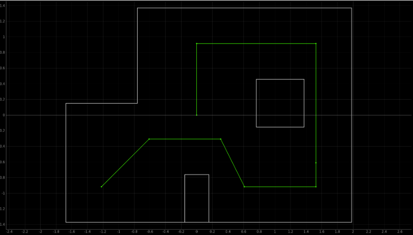

## LAB 13: PLANNING AND EXECUTION

[Back to Home](./index.html)

This is the last one! This is where the semester’s work with the robots comes to a conclusion, as we move the robot over a set of predetermined points in the map to complete a trajectory. Here, we use the closed-loop PID control that we implemented in Labs 6-8, along with mapping, localization and offboard computing from Labs 9-12 to perform the desired motion with the robot. This lab gave us complete freedom to come up with our own solution - the only constraint was to hit the points on the trajectory. We used a combination of PID control for waypoint navigation as well as robot localization to successfully complete the trajectory, as detailed in the report below.

#### Collaborators

As with the previous labs, I collaborated with Krithik Ranjan and Aryaa Pai. We continued to use Krithik’s robot and Artemis bluetooth codebase, and ran Python code through Jupyter notebooks on mine and Aryaa’s computers. 

#### Trajectory

The robot needed to hit the following points to successfully complete the trajectory; the representation is provided on the simulator map as well:

```
- (-4, -3)
- (-2, -1)
- (1, -1)
- (2, -3)
- (5, -3)
- (5, -2)
- (5, 3)
- (0, 3)
- (0, 0)
```



#### PID setup for Translation and Orientation

In order to navigate through the map, we needed to have We already had PID control for orientation set up by virtue of the previous labs (6, 8, 9), which allowed the robot to turn a specified angle using a bluetooth command `CMD.TURN_ANGLE`. As with the previous labs, we adjusted the Python code to account for the clockwise rotation of the robot (due to IMU placement) against the counterclockwise rotation expected for the trajectory. We used two point calibration to minimize the linear offset and drift in the gyroscope - a raw rotation of 360 degrees usually corresponded to between 500 and 560 degrees depending on the battery.

<iframe width="560" height="315" src="https://www.youtube.com/embed/suO21N8s-Qs" title="YouTube video player" frameborder="0" allow="accelerometer; autoplay; clipboard-write; encrypted-media; gyroscope; picture-in-picture" allowfullscreen></iframe>

We added PD control for distance as part of this lab based on the ToF sensor measurements. The robot receives a desired distance as part of a Bluetooth command, which is subtracted from the current ToF reading to determine what the ToF reading should be at the set point it is meant to reach. To account for any error in distance readings from the ToF, we average 10 readings from the sensor before moving forward. The following video illustrates closed loop control with both angle and distance.

<iframe width="560" height="315" src="https://www.youtube.com/embed/5G2pHJWE9Ds" title="YouTube video player" frameborder="0" allow="accelerometer; autoplay; clipboard-write; encrypted-media; gyroscope; picture-in-picture" allowfullscreen></iframe>

#### Approach 1: Pure PID Path Following

The first approach we tried was pure PID control for traveling over the entire trajectory. We fixed the initial setpoint, and programmed functions to determine the angle and distance needed to travel between the current and next waypoints using feedback control from the sensors, since we were confident in our closed loop control functionality. 

```python
# Pseudocode for performing trajectory using PID 
                    
curr_pose = (-4, -3, 0)
trajectory = [(-4, -3),(-2, -1),(1, -1),(2, -3),(5, -3),(5, -2),(5, 3),(0, 3),(0, 0)]

ble.send_command(TUNE_PID)

for next_pose in trajectory[1:]:
    # Calculate rotation required to get to next point and rotate 
    rot = calc_rot(curr_pose, next_pose)    
    ble.send_command(TURN_ANGLE)

    # Calculate translation to get to next point and move 
    trans = calc_trans(curr_pose, next_pose)
    ble.send_command(MOVE)

    # Update pose 
    new_angle = normalize(curr_pose[2] + rot)
    curr_pose = (next_pose, new_angle) 
```

We quickly realized that there were positions at which the ToF sensor could not accurately sample distance (especially since it was set to the medium ranging mode, which proved to be reliable for distances up to roughly 1.5 meters). The robot’s straight line motion drifted between the (5, -2) and (5, 3) waypoints, so we added a 180 degree rotation at (5, 0) to reorient the ToF sensor.

<iframe width="560" height="315" src="https://www.youtube.com/embed/4ZCnaeePlQA" title="YouTube video player" frameborder="0" allow="accelerometer; autoplay; clipboard-write; encrypted-media; gyroscope; picture-in-picture" allowfullscreen></iframe>

With this fix, we were able to get two good runs of the trajectory.

<iframe width="560" height="315" src="https://www.youtube.com/embed/dkwzKjAAAvA" title="YouTube video player" frameborder="0" allow="accelerometer; autoplay; clipboard-write; encrypted-media; gyroscope; picture-in-picture" allowfullscreen></iframe>

<iframe width="560" height="315" src="https://www.youtube.com/embed/5xaeiuZpZhs" title="YouTube video player" frameborder="0" allow="accelerometer; autoplay; clipboard-write; encrypted-media; gyroscope; picture-in-picture" allowfullscreen></iframe>

We did notice that we were constantly running into issues with the rotation and translation from (1, -1) to (2, -3) due to the angles being more irregular than we could reliably perform. We changed the trajectory to make the robot cross (1, -1) and stop at (2, -1) - this allowed us to perform a 90 degree turn to reach (2, -3), and then another 90 degree turn for reaching (5, -3). This improved the performance of the PD control for rotation as well as the path following, as shown in the video below.

<iframe width="560" height="315" src="https://www.youtube.com/embed/L7tFzi5HzXM" title="YouTube video player" frameborder="0" allow="accelerometer; autoplay; clipboard-write; encrypted-media; gyroscope; picture-in-picture" allowfullscreen></iframe>

In general, this method was not as reliable as we initially believed. We spent days tuning PD gains, calibrating distances and angles and recording videos that were almost perfect. There were too many variables that we could not control - battery discharge, lighting, floor roughness, sensor noise being just a few, Each run was different from the previous one in a fairly significant way despite the code being exactly the same. The video below captures some of the less successful runs, illustrating the issues with “open-closed loop” control (since the waypoints were open loop, but robot motion was closed loop).

<iframe width="560" height="315" src="https://www.youtube.com/embed/Lh_LxcFjl4A" title="YouTube video player" frameborder="0" allow="accelerometer; autoplay; clipboard-write; encrypted-media; gyroscope; picture-in-picture" allowfullscreen></iframe>

#### Approach 2: Localization and Path Planning

We switched to incorporating localization after we realized that there were issues with PID control that caused us to miss waypoints on the trajectory. We added in localization using Bayes’ Filter based on our results from Lab 12 - the intent was to allow the robot to make mistakes, but identify where it was and determine the right movement to reach the waypoint it was meant to reach. Similar to Lab 12, we make the robot perform a 360 degree loop over 20 degree increments to record ToF values, which are then sent back to the Jupyter notebook to perform the update step and calculate the robot’s belief regarding its current position (the pose with the highest probability).

We started by introducing localization at (2, -3), since that proved to be the most troublesome spot on the map for our PID navigator. We used the 90 degree PID control mechanism described above to reach (2, -3), then performed an observation loop to obtain localization data and accordingly translate to (5, -3). We realized after a couple of runs that this changed the orientation of the robot at (5, -3) and all subsequent points, rendering our earlier control scheme useless and so decided to integrate localization at every waypoint on the map. The pseudocode broadly illustrates our approach, with the video depicting its results.

```python
# Pseudocode for performing trajectory with localization
                    
curr_pose = (-4, -3, 0)
trajectory = [(-4, -3),(-2, -1),(1, -1),(2, -3),(5, -3),(5, -2),(5, 3),(0, 3),(0, 0)]

ble.send_command(TUNE_PID)

for next_pose in trajectory[1:]:
    # Calculate rotation required to get to next point and rotate 
    rot = calc_rot(curr_pose, next_pose)    
    ble.send_command(TURN_ANGLE)

    # Calculate translation to get to next point and move 
    trans = calc_trans(curr_pose, next_pose)
    ble.send_command(MOVE)

    # Localize 
    loc.get_observation_data()
    loc.update_step()

    # Update pose from belief 
    curr_pose = loc.belief

    # Reinitialize grid belief as only update step 
    loc.init_grid_beliefs()
```

<iframe width="560" height="315" src="https://www.youtube.com/embed/rvz03qboRMo" title="YouTube video player" frameborder="0" allow="accelerometer; autoplay; clipboard-write; encrypted-media; gyroscope; picture-in-picture" allowfullscreen></iframe>

This approach clearly has some pitfalls - the robot seems to miss a point and continue through the trajectory instead of revisiting the desired destination. We realized that we didn’t have a threshold which the robot could use as an indicator of its success on the trajectory. While implementing this mechanism, we discussed what value might be best - a lower margin (within 10cm of desired location) would mean more accurate navigation, but when this was implemented, the robot began to oscillate around a point in order to achieve it.

<iframe width="560" height="315" src="https://www.youtube.com/embed/tnUhU_fP5kw" title="YouTube video player" frameborder="0" allow="accelerometer; autoplay; clipboard-write; encrypted-media; gyroscope; picture-in-picture" allowfullscreen></iframe>

Thereafter, we chose to allow a linear single block radius of error (about 35 cm) for the robot. We were able to use this to get better results.

<iframe width="560" height="315" src="https://www.youtube.com/embed/59VhsZ2na8A" title="YouTube video player" frameborder="0" allow="accelerometer; autoplay; clipboard-write; encrypted-media; gyroscope; picture-in-picture" allowfullscreen></iframe>

As the above video illustrates, the robot gets stuck between the (5, -3) and (5, -2) waypoints, since it perceives its location to be different from where it actually is. We switched approaches and attempted to follow the trajectory backward instead after talking with the other teams during a late night stint in the lab about their own observations. This worked far more reliably, with the robot achieving every waypoint within the one block limit and localizing itself really well. Two of the best runs we have are illustrated below. 

<iframe width="560" height="315" src="https://www.youtube.com/embed/pZdT8gnx1Kk" title="YouTube video player" frameborder="0" allow="accelerometer; autoplay; clipboard-write; encrypted-media; gyroscope; picture-in-picture" allowfullscreen></iframe>

<iframe width="560" height="315" src="https://www.youtube.com/embed/tPD2oGf7Nn0" title="YouTube video player" frameborder="0" allow="accelerometer; autoplay; clipboard-write; encrypted-media; gyroscope; picture-in-picture" allowfullscreen></iframe>

#### Wrapping Up

I really enjoyed this lab! As a robotics aficionado, this course taught me the importance of being a full-stack roboticist, and how to identify pitfalls in both hardware and software that impede the performance of the robot. We managed to integrate so many different ideas we learned in this course - from control to mapping to state estimation, we covered a spectrum of different topics relevant to robotics. I am delighted that this was my final ECE course, and I’m certain that I will be using the lessons I learned from this class in my professional life. Thanks to Professor Petersen, Jonathan, Vivek, and Jade for making this course so worthwhile!

#### Appendix

This contains the localization output for the backward trajectory path execution.

```
2022-05-20 02:23:30,354 | INFO     |: Initializing beliefs with a Uniform Distribution
2022-05-20 02:23:30,357 | INFO     |: Uniform Belief with each cell value: 0.00051440329218107

2022-05-20 02:23:30,786 | INFO     |: Movement: 1
2022-05-20 02:23:30,787 | INFO     |: Currently At : (0.0, 0.0)
2022-05-20 02:23:30,787 | INFO     |: Going to : (0.0, 3.0)
2022-05-20 02:23:30,904 | INFO     |: Localizing
2022-05-20 02:23:56,169 | INFO     |: Update Step
2022-05-20 02:23:56,185 | INFO     |:      | Update Time: 0.013 secs
2022-05-20 02:23:56,193 | INFO     |: Belief: (1.0000000000000009, -3.0, -170.0)
2022-05-20 02:23:56,200 | INFO     |: Initializing beliefs with a Uniform Distribution
2022-05-20 02:23:56,206 | INFO     |: Uniform Belief with each cell value: 0.00051440329218107

2022-05-20 02:23:56,209 | INFO     |: Movement: 2
2022-05-20 02:23:56,210 | INFO     |: Currently At : (1.0, -3.0)
2022-05-20 02:23:56,218 | INFO     |: Going to : (0.0, 3.0)
2022-05-20 02:23:56,881 | INFO     |: Localizing
2022-05-20 02:24:21,773 | INFO     |: Update Step
2022-05-20 02:24:21,797 | INFO     |:      | Update Time: 0.008 secs
2022-05-20 02:24:21,797 | INFO     |: Belief: (6.0, 2.0, -30.0)
2022-05-20 02:24:21,806 | INFO     |: Initializing beliefs with a Uniform Distribution
2022-05-20 02:24:21,807 | INFO     |: Uniform Belief with each cell value: 0.00051440329218107

2022-05-20 02:24:21,811 | INFO     |: Movement: 2
2022-05-20 02:24:21,812 | INFO     |: Currently At : (6.0, 2.0)
2022-05-20 02:24:21,812 | INFO     |: Going to : (0.0, 3.0)
2022-05-20 02:24:22,624 | INFO     |: Localizing
2022-05-20 02:24:48,185 | INFO     |: Update Step
2022-05-20 02:24:48,196 | INFO     |:      | Update Time: 0.010 secs
2022-05-20 02:24:48,199 | INFO     |: Belief: (0.0, 2.0, -170.0)
2022-05-20 02:24:48,203 | INFO     |: Initializing beliefs with a Uniform Distribution
2022-05-20 02:24:48,205 | INFO     |: Uniform Belief with each cell value: 0.00051440329218107

2022-05-20 02:24:48,207 | INFO     |: Movement: 3
2022-05-20 02:24:48,210 | INFO     |: Currently At : (0.0, 2.0)
2022-05-20 02:24:48,213 | INFO     |: Going to : (5.0, 3.0)
2022-05-20 02:24:49,024 | INFO     |: Localizing
2022-05-20 02:25:13,858 | INFO     |: Update Step
2022-05-20 02:25:13,874 | INFO     |:      | Update Time: 0.017 secs
2022-05-20 02:25:13,878 | INFO     |: Belief: (5.000000000000001, 2.000000000000001, 10.0)
2022-05-20 02:25:13,882 | INFO     |: Initializing beliefs with a Uniform Distribution
2022-05-20 02:25:13,884 | INFO     |: Uniform Belief with each cell value: 0.00051440329218107

2022-05-20 02:25:13,887 | INFO     |: Movement: 4
2022-05-20 02:25:13,890 | INFO     |: Currently At : (5.0, 2.0)
2022-05-20 02:25:13,893 | INFO     |: Going to : (5.0, -2.0)
2022-05-20 02:25:14,577 | INFO     |: Localizing
2022-05-20 02:25:39,189 | INFO     |: Update Step
2022-05-20 02:25:39,200 | INFO     |:      | Update Time: 0.010 secs
2022-05-20 02:25:39,203 | INFO     |: Belief: (5.0, -1.0, -90.0)
2022-05-20 02:25:39,207 | INFO     |: Initializing beliefs with a Uniform Distribution
2022-05-20 02:25:39,207 | INFO     |: Uniform Belief with each cell value: 0.00051440329218107

2022-05-20 02:25:39,212 | INFO     |: Movement: 5
2022-05-20 02:25:39,214 | INFO     |: Currently At : (5.0, -1.0)
2022-05-20 02:25:39,217 | INFO     |: Going to : (5.0, -3.0)
2022-05-20 02:25:39,547 | INFO     |: Localizing
2022-05-20 02:26:04,379 | INFO     |: Update Step
2022-05-20 02:26:04,395 | INFO     |:      | Update Time: 0.016 secs
2022-05-20 02:26:04,396 | INFO     |: Belief: (6.000000000000001, -3.999999999999999, -90.0)
2022-05-20 02:26:04,398 | INFO     |: Initializing beliefs with a Uniform Distribution
2022-05-20 02:26:04,399 | INFO     |: Uniform Belief with each cell value: 0.00051440329218107

2022-05-20 02:26:04,400 | INFO     |: Movement: 5
2022-05-20 02:26:04,400 | INFO     |: Currently At : (6.0, -4.0)
2022-05-20 02:26:04,402 | INFO     |: Going to : (5.0, -3.0)
2022-05-20 02:26:05,162 | INFO     |: Localizing
2022-05-20 02:26:29,345 | INFO     |: Update Step
2022-05-20 02:26:29,355 | INFO     |:      | Update Time: 0.010 secs
2022-05-20 02:26:29,361 | INFO     |: Belief: (4.0, -2.0, 150.0)
2022-05-20 02:26:29,364 | INFO     |: Initializing beliefs with a Uniform Distribution
2022-05-20 02:26:29,364 | INFO     |: Uniform Belief with each cell value: 0.00051440329218107

2022-05-20 02:26:29,370 | INFO     |: Movement: 5
2022-05-20 02:26:29,371 | INFO     |: Currently At : (4.0, -2.0)
2022-05-20 02:26:29,375 | INFO     |: Going to : (5.0, -3.0)
2022-05-20 02:26:30,244 | INFO     |: Localizing
2022-05-20 02:26:55,144 | INFO     |: Update Step
2022-05-20 02:26:55,154 | INFO     |:      | Update Time: 0.010 secs
2022-05-20 02:26:55,162 | INFO     |: Belief: (5.0, -3.0, -30.0)
2022-05-20 02:26:55,165 | INFO     |: Initializing beliefs with a Uniform Distribution
2022-05-20 02:26:55,166 | INFO     |: Uniform Belief with each cell value: 0.00051440329218107

2022-05-20 02:26:55,171 | INFO     |: Movement: 6
2022-05-20 02:26:55,172 | INFO     |: Currently At : (5.0, -3.0)
2022-05-20 02:26:55,177 | INFO     |: Going to : (2.0, -3.0)
2022-05-20 02:26:55,972 | INFO     |: Localizing
2022-05-20 02:27:20,460 | INFO     |: Update Step
2022-05-20 02:27:20,475 | INFO     |:      | Update Time: 0.015 secs
2022-05-20 02:27:20,475 | INFO     |: Belief: (3.0, -3.0, -170.0)
2022-05-20 02:27:20,482 | INFO     |: Initializing beliefs with a Uniform Distribution
2022-05-20 02:27:20,486 | INFO     |: Uniform Belief with each cell value: 0.00051440329218107

2022-05-20 02:27:20,488 | INFO     |: Movement: 7
2022-05-20 02:27:20,488 | INFO     |: Currently At : (3.0, -3.0)
2022-05-20 02:27:20,493 | INFO     |: Going to : (1.0, -1.0)
2022-05-20 02:27:21,126 | INFO     |: Localizing
2022-05-20 02:27:45,180 | INFO     |: Update Step
2022-05-20 02:27:45,199 | INFO     |:      | Update Time: 0.020 secs
2022-05-20 02:27:45,209 | INFO     |: Belief: (1.0, -1.0, 110.0)
2022-05-20 02:27:45,213 | INFO     |: Initializing beliefs with a Uniform Distribution
2022-05-20 02:27:45,215 | INFO     |: Uniform Belief with each cell value: 0.00051440329218107

2022-05-20 02:27:45,217 | INFO     |: Movement: 8
2022-05-20 02:27:45,220 | INFO     |: Currently At : (1.0, -1.0)
2022-05-20 02:27:45,222 | INFO     |: Going to : (-2.0, -1.0)
2022-05-20 02:27:46,257 | INFO     |: Localizing
2022-05-20 02:28:10,868 | INFO     |: Update Step
2022-05-20 02:28:10,876 | INFO     |:      | Update Time: 0.008 secs
2022-05-20 02:28:10,883 | INFO     |: Belief: (-2.0, -1.0, 150.0)
2022-05-20 02:28:10,887 | INFO     |: Initializing beliefs with a Uniform Distribution
2022-05-20 02:28:10,888 | INFO     |: Uniform Belief with each cell value: 0.00051440329218107

2022-05-20 02:28:10,892 | INFO     |: Movement: 9
2022-05-20 02:28:10,893 | INFO     |: Currently At : (-2.0, -1.0)
2022-05-20 02:28:10,897 | INFO     |: Going to : (-4.0, -3.0)
2022-05-20 02:28:11,936 | INFO     |: Localizing
2022-05-20 02:28:36,906 | INFO     |: Update Step
2022-05-20 02:28:36,924 | INFO     |:      | Update Time: 0.018 secs
2022-05-20 02:28:36,930 | INFO     |: Belief: (-3.0, -2.0, -110.0)
2022-05-20 02:28:36,932 | INFO     |: Initializing beliefs with a Uniform Distribution
2022-05-20 02:28:36,933 | INFO     |: Uniform Belief with each cell value: 0.0005144032921810

2022-05-20 02:28:37,502 | INFO     |: Done
```

