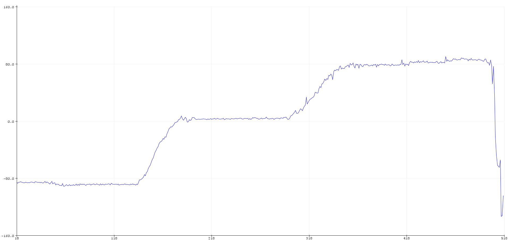
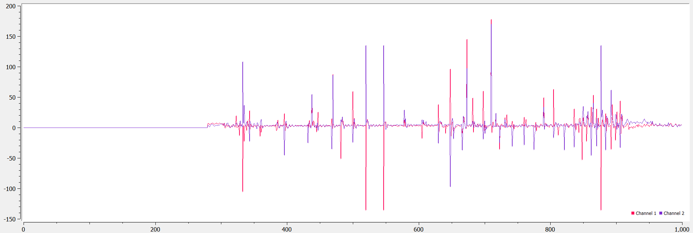

## LAB 3: SENSORS

[Back to Home](./index.html)

This lab contends with setting up and experimenting with two key sensors - an inertial measurement unit (IMU) and a time-of-flight (ToF) sensor. These two sensors are extremely important for characterizing a fast robot since they have extremely quick acquisition rates for crucial data - ToF sensors are used to measure distance from a series of targets/ obstacles, while IMUs can provide linear acceleration and orientation information. We start with setting up and testing the I2C connection to the sensors before writing software to measure the accuracy of and obtain additional information from the sensors.

### Hardware & Software Setup
This lab was the first to involve hardware elements other than just the Artemis. All the given sensors use I2C as the communication protocol, and the Artemis features a Qwiic connector that simplifies the wire connection for the protocol by breaking out the 3.3V power (3V3), ground (GND), data (SDA) and clock (SCL) lines. However, the sensors do not have any Qwiic terminals, requiring us to solder directly to the breakouts. Since each sensor has only a single set of breakouts, we need to daisy chain the I2C connections.

By viewing the setup on the lab demo car and taking some measurements of my own, I decided on a preliminary placement of sensors. I soldered the IMU first (which will go on a flat housing near the front of the robot) and then chained the wires to the ToF sensors, leaving enough wire length for two alternate placements of the sensors: one on the front and one on the side of the car, or both on the front depending on which method is more relevant for the lab task in question. In addition, one of the ToF sensors requires an input to the XSHUT pin so that the other can be programmed independently - I connected ToF1 to pin 8 on the Artemis. The complete sensor setup is shown in the following diagram.

The software setup simply involved installing the SparkFun 9DOF IMU Breakout - ICM 20948 and SparkFun VL53L1X 4m laser distance sensor libraries from the library manager. I also installed SerialPlot to visualize data from the Artemis a little more intuitively than allowed by the serial plotter built into the Arduino IDE.

### Prelab

The ToF sensors have an I2C address of 0x52 (although this is bit-shifted to get an address of 0x29 on the Artemis). Since the address is hardwired, we can either use the active low XSHUT pin to dictate which sensor is measuring data, or change one sensor’s address through software, which will involve temporarily shutting down the other sensor. I chose to follow the latter approach, since it allows us to acquire data from both sensors at the same time, which will prove useful in later labs.

The documentation specifies that the ToF sensors have adjustable distance measurement settings and an angular range of 15 to 27 degrees. The sensors have a default “long” measurement range of up to 4 meters; however, this measurement is vulnerable to error due to ambient light incident upon the sensor. In addition, the sensor has a “short” ranging mode of up to 1.3 meters, as well as a “medium” ranging mode of up to 3 meters. The `VL53L1_SetDistanceMode()` function can be used to change the ranging protocol on the sensor. 

For the purposes of this course, I believe that using both sensors with the “short” ranging mode or one with a “short” mode and the other with the “medium” mode would be ideal to obtain more accurate measurements and update our car’s state and controls as desired. The latter approach would definitely prove more useful if the two sensors were mounted next to each other, while the former would be applicable if the sensors were mounted perpendicular to each other. In both cases, there are instances in which the sensors will not identify obstacles - with both the sensors in the front, we might not be able to identify obstacles in the car’s turning range, while having the sensor off to one side only would lead to loss of information about the world on the opposite side unless we periodically rotate the car around.

### 3A: Time of Flight Sensors

After completing the necessary solder connections, I ran the sample script to scan for the I2C address of the sensor. However, since I had soldered the IMU before either ToF sensor, the sketch printed out every single I2C address possible (a known issue addressed in the course discussion). Seeing no other errors, I moved on to testing the `Example1_ReadDistance` to read distance from the sensor as provided by the library. I mounted the sensor to my laptop using a piece of double sided tape, and used a measuring tape to check the distance between the sensor and (a) a white plaster wall and (b) a wooden door - there was no clearly observable difference between the surfaces, although the values did tend to be a little lower when measuring distances greater than 1.5 meters from the door. I conducted measurements using the short and medium ranging modes - the graph below averages the distance readings from both surfaces. In addition, I set the timing budget to its minimal value of 20ms using the `setTimingBudgetinMs()` function to check the impact on the data acquired from the ToF sensors. I found that there is no significant difference in the accuracy of the sensor with the change in timing budget, meaning that we can employ a faster rate of acquisition for our robot.

To get both sensors working, I used the XSHUT pin to shut down ToF 1, assigned ToF 2 a new I2C address (0x33) and reactivated ToF 1. The code for this section and the output from the serial monitor is shown below.

### 3B: Inertial Measurement Unit

A first run of the example code did not work - I realized that I needed to change the value of the AD0_VAL from 1 to 0 to correct for the last bit of the I2C address due to the closed ADR jumper. I noticed that leaving the board lying flat records a high z-component of acceleration. Rotating or flipping the board changes the gyroscope recordings since the orientation of the board changes. The IMU's I2C address is 0x68 - the output of the serial monitor's measurements is shown in the image below and the change in readings as the board rotates is shown in the video.

#### Accelerometer

We can use equations discussed in class to calculate the desired roll and pitch from accelerometer data. We notice that there is some deviation (around 4 to 5 degrees) as the IMU is held at positions of -90, 0 and 90 degrees for pitch and roll measurements. Using Adafruit’s explanation on two point calibration for scaling measurements (available [here](https://learn.adafruit.com/calibrating-sensors/two-point-calibration)), I was able to obtain a better series of readings. The first two plots show the uncalibrated results of roll and pitch calculations, while the other two show the roll and pitch calibrated within the -90 to +90 degree range.

To study the noise, we need to measure the time taken by the sensor to acquire data to determine the sampling frequency and calculate the FFT of that data. Continuous data acquisition from the IMU shows that the approximate interval between 2  readings is about 6 ms on average, which gives us a sampling frequency of about 170 Hz. I tapped the IMU lightly while it was lying on a flat surface to generate some noise and obtained the following graphs. From the plots, it is clear that there is no explicit frequency at which noise is generated, since our sampling frequency is a lot lower than the higher frequencies at which noise would be visible.

We can still implement a complimentary low pass filter to make the readings smoother. This took some trial and error to find the ‘best’ alpha value - ultimately, it seems that an alpha value of 0.05 minimizes the amplitude of the noise on the accelerometer and restores to a consistent ground state after tapping the IMU. In the plot below, we see that the IMU responds to large deviations (as on the right), but gentle taps do not register as much (as on the left side of the same plot_.

#### Gyroscope

We can use the gyroscope to calculate roll, pitch, and yaw angles as discussed in class. Since obtaining angles from the gyroscope’s angular velocity data requires integration, we notice a drift build up steadily over time even when the sensor is lying flat. However, the gyroscope is a lot less susceptible to noise than the accelerometer readings, even though the latter seem to be more accurate. Increasing the sampling frequency would result in increasing the speed of the drift (since we would be integrating faster than before) but might also increase the resolution of the obtained angles.

To correct the drift, we can use a complimentary filter similar to the accelerometer. In this case, I chose to use the roll and pitch angles obtained from the accelerometer. This stabilized the angles obtained from the sensor by eliminating the impact of potential noise and drift, while simultaneously improving the response time and accuracy.

