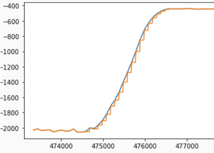

## LAB 8: STUNTS

[Back to Home](./index.html)

This lab ends the three lab sequence started in Lab 6, and is a culmination of the material covered in the first half of the course. We know from the robot characterization lab that the car is capable of extremely fast motion; we can use our implemented closed loop control alongside a Kalman Filter to predict the robot’s distance from the wall so that we can “safely” execute the desired stunt before the robot hits the wall. We then move on to performing a purely open loop stunt - this is just to show off some robot capabilities that may be difficult to capture using closed loop control. For this lab, I used Krithik Ranjan’s robot alongside my own codebase due to persisting issues with my hardware.

#### Drift Much?

I chose the “Drift Much” task for lab 6, which involves driving up to a specified distance away from a wall from a given starting point, performing a 180 degree “drift” turn and returning to the starting point. The PD controller from Lab 6 operates over gyroscope values in order to perform the turn. I retuned the motor setpoints and PD gains to increase the speed at which the robot could execute the turn. The distance from the wall is obtained from the time of flight sensor data - however, due to its slow sampling time, we use the Kalman filter implemented in the previous lab to predict the next distance measurement based on past measurements.

On average, the latency between ToF sensor readings is 100ms. The Kalman filter implemented in Lab 7 is capable of reducing this time, however, it must be noted that it only executes the “update” step, which is run whenever data is available. In order to improve the speed of the ToF sensor, I implemented the “prediction” step of the filter as well, tuning it in python before implementing it in the Artemis code. However, I observed the same issue from the previous lab recurring - the filter seemed to “follow” the trend of the last distance measured for some time rather than predicting the next value obtained by the sensor. The update step of the filter seems to put excessive faith in sensor values (even though noise is substantially reduced), which may be problematic when trying to estimate the distance accurately for the turn. Nevertheless, I decided to use the Kalman filter to predict sensor values for the turn. The following snippet illustrates the pseudocode for the prediction and update steps for the filter.

```
# Kalman function implementation

function Kalman (x, sig, u, z):
    # Prediction step 
    x_p = Ad.x + Bd.x 
    sig_p = Ad.sig.Ad[T] + sig_u

    # Update step 
    KF = sig_p.C[T].(C.sig_p.C[T] + sig_z)^(-1)
    x_n = x_p + KF.(z - C.x_p)
    sig_n = (I - KF.C).sig_p

    Return x_n, sig_n 
```



The control sequence for the stunt was quite straightforward. The robot is meant to start about 4 meters away from the wall, drive until it is 0.6 meters away from the wall, execute the 180 degree turn and drive back to its starting point. I used code from Lab 6 to execute the turn, and integrated the Kalman filter to drive forward to the 0.6 meter mark. I drove forward with a PWM value of 200 for faster action, and adjusted the PD gains for the turn to account for the difference in the floor as well as better response time. Due to the issues with the Kalman filter and minor latencies in bluetooth communication, I had to start the turn earlier to hit the 0.6 meter threshold, around the 1 meter mark. Check out the video below for the stunt!

<iframe width="560" height="315" src="https://www.youtube.com/embed/c6GeIn7NGfg" title="YouTube video player" frameborder="0" allow="accelerometer; autoplay; clipboard-write; encrypted-media; gyroscope; picture-in-picture"></iframe>

#### Open Loop, Repeatable Stunt

In this stunt, I used timing instead of PD control on the sensors. I chose to replicate the “tree flip” stunt that I tried in Lab 4, with the robot driving forward into a box and flipping over. The control was extremely simple - I made the robot drive forward for 8 seconds at maximum speed and placed it about 2 meters away from the wall to get good momentum for the flip. Videos below!

** Video 1**

** Video 2**

** Video 3**
