## LAB 9: MAPPING

[Back to Home](./index.html)

With the previous labs establishing the various functionalities of our robot culminating in stunt performance, we move on to performing more practical tasks in this latter part of the course. We start with mapping a static environment that consists of walls and obstacles - gathering this data from the real robot allows us to effectively use simulation to verify our localization and planning algorithms before testing them on hardware. We collect data from multiple different points within the environment in order to generate a more complete representation of our environment and observe the vulnerabilities of the ToF sensor granularity, which will be useful while executing autonomous navigation.

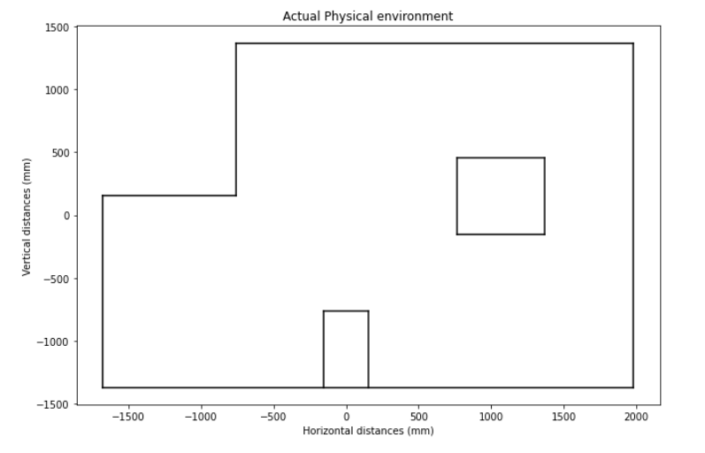

#### Collaborators

As before, I collaborated with Krithik Ranjan and Aryaa Pai while collecting sensor readings and processing data. I had to rely on Krithik’s hardware for this lab - I damaged my IMU and a ToF sensor trying to perform stunts prior to this lab, and could not fix the issue in time.

#### Prelab

This prelab only required understanding transformation matrices so that we know how to offset the measurements from the ToF sensor.

#### PID Control

In the earlier sequence of labs, I performed the “drift” task using PD control on the yaw angle obtained from the IMU. To calculate the yaw angle, I use a complimentary filter on the yaw value obtained from the gyroscope and the magnetometer in order to increase the reliability of my readings. PD control for the drift task involved making the robot execute a 180 degree turn at a fixed distance from a wall; for obtaining somewhat precise readings of an environment, I had to break this down to smaller increments of orientation (around 8 to 10 degrees). The video below shows the robot performing an on-axis rotation for turns of around 18 degrees.

<iframe width="560" height="315" src="https://www.youtube.com/embed/V0igMi5FY1Y" title="YouTube video player" frameborder="0" allow="accelerometer; autoplay; clipboard-write; encrypted-media; gyroscope; picture-in-picture" allowfullscreen></iframe>

It proved to be a lot more difficult than expected to get smaller angular measurements down correctly. The gyroscope suffers from a constant linear offset, wherein 180 degrees corresponds to about 150 degrees. I tried experimenting with 20 degree turns at first, finding that the robot rotates about 17 degrees for this setpoint. However, a somewhat more concerning issue is that the robot begins to jitter after each rotation because the PID controller is compensating for the error in its position. Since we want to obtain good readings from the time-of-flight sensor, it is important for the robot to be stationary to get accurate distance measurements - in order to minimize the impact of this error, I decreased the angular increment at which the robot turns as well as the proportional constant for turning to avoid overshoot. As a result, I was able to obtain a smoother rotation with an 8 to 10 degree setpoint. The variability of the orientation is shown below - once the robot reaches the desired orientation, it stops for a few seconds (ie a PWM of 0) and the ToF sensor captures a reading before moving forward.

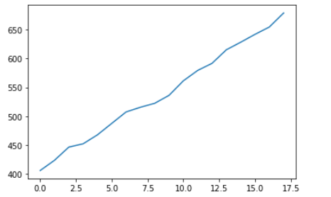

We measured the environment from multiple different points around the room - while doing so I noticed that the robot drifted from its initial position by a few centimeters, which can be quite impactful especially in a smaller space. In a 4x4 meter square room, I would expect that the initial distance measurements during an on axis turn would be accurate (depending on the sensor), but would expect readings to start deviating by around 5 to 10 centimeters through the course of the turn. 

#### Distance Readouts

I collected ToF data from all 5 points marked on the grid space. Initially, I noticed some discrepancy between the measured and actual distance readings, which I realized was caused by the ToF sensor not being set to a longer ranging mode - after fixing that, I was able to obtain better results. I chose to rely on the robot’s orientation control instead of reading out integrated gyroscope values, particularly since I observed that the robot reliably turned fully on its axis within the desired number of turns. 

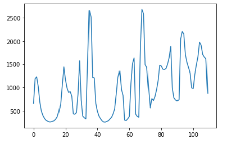

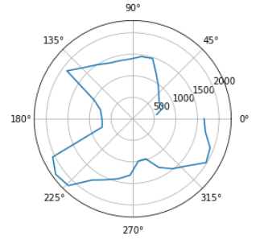

I initially tried using a polar plot to sanity check my measurements - however, after consulting with course staff, I decided that plotting the cartesian coordinates would help me better understand my data. I offset the data based on the robot’s starting position, and calculated the angles based on the number of turns the robot made. I simply used the formula x = r cos(theta) and y = r sin(theta) to convert the averaged distance/ angle measurements into the 2D cartesian plane. The scatter plots below illustrate the map generated by the robot at each of the labeled 5 positions (with units in mm).

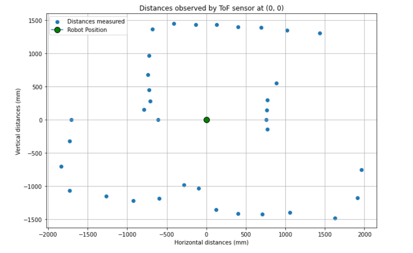

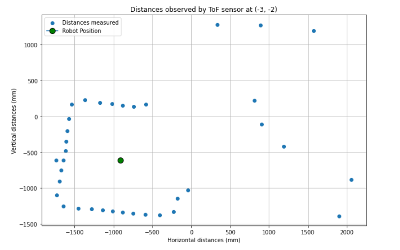

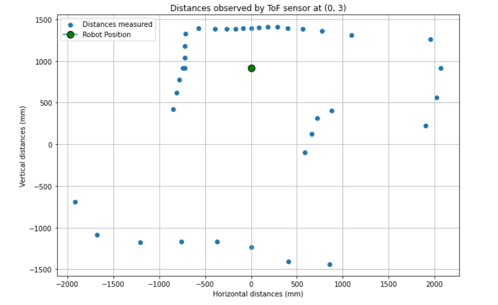

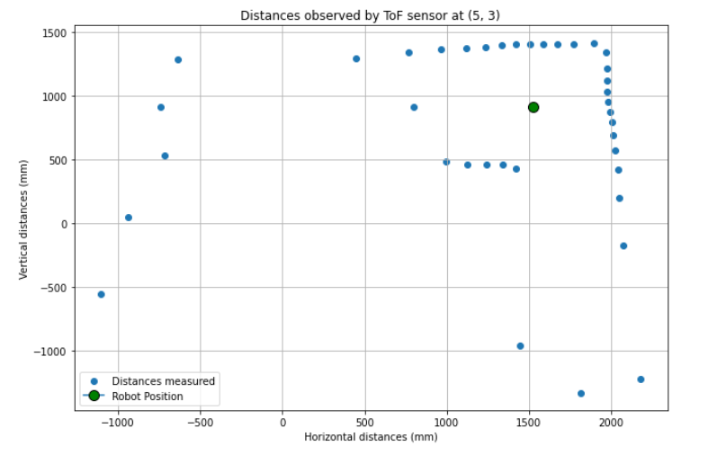

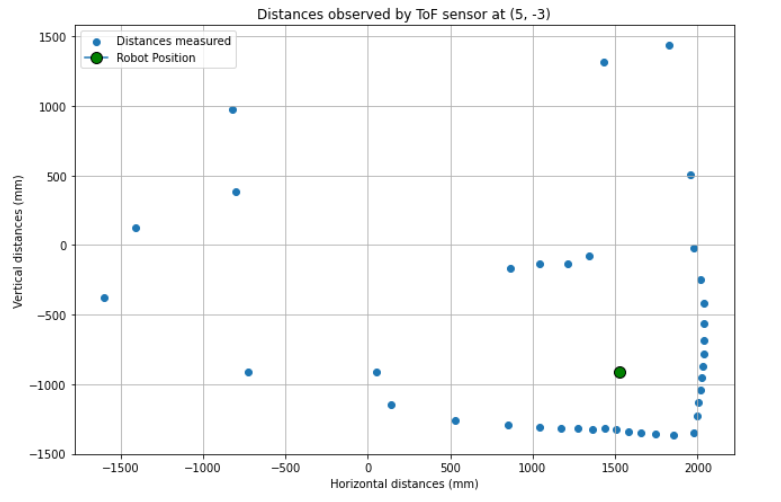

I notice that the ToF sensor on the robot is pretty good at capturing walls/ obstacles so long as they are in its immediate vicinity - further objects are difficult to “see” and are even missed. I constructed a collective map of all the sensor data to notice what the observed environment looked like. I extracted the physical representation of the map from the `world.yaml` file in the simulator and graphed it alongside the data as follows.

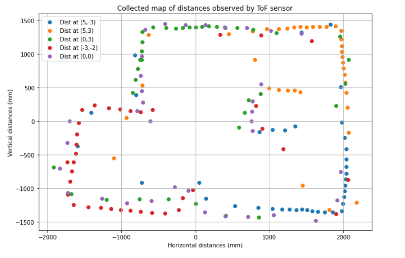

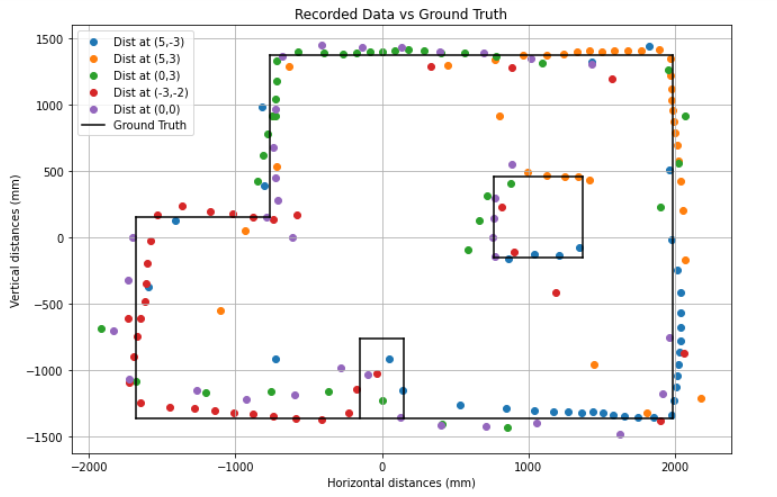

Finally, I created an inferred plot based on the readings I received from the ToF sensor. Instead of accounting for each sensor measurement (which would create a noisy map representation), I used the furthest points at each corner to “estimate” what the robot understood to be its environment. This inferred environment is plotted alongside the physical representation from the simulation.

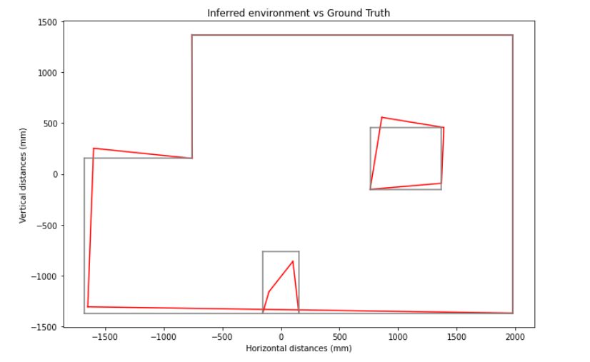

This was an interesting lab! I’m excited to use the map we generated for more complex tasks in the upcoming few weeks.

